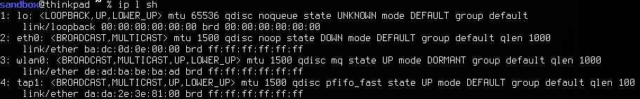
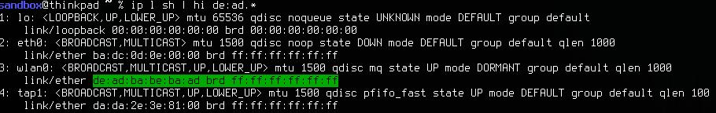

## Hi
hi behaves like grep, except hi prints everything, and highlights the matching pattern.
hi highlights, grep cuts

## Why its useful
###You need to find a network interface with the mac address, for example. de:ad:ba:be:ba:ad


###Grep is good at finding the mac address string

###However, it doesn't solve our problem. We need the name of the interface with that mac address.

###hi will highlight the matching string, without getting rid of the rest of the text


## Installation
### Precondition: You have the go compiler 'go' installed on your system

```
	go get github.com/as/hi
	go install hi
	
	cd $GOBIN
	chmod a+x hi

	// You can move hi to /usr/bin, or add $GOBIN to your $PATH
```
